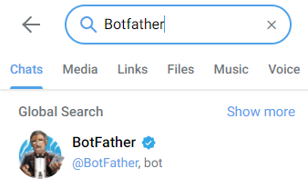

# **Dog Bot**

Passo a passo de como criar um dogbot no telegram, com 
todas as dicas para você fazer tudo sozinho. =D

## Preparação

Antes de começarmos a escrever o código, é necessário criar um bot
no telegram e criar um ambiente virtual para isolar a aplicação.

#### [BotFather](https://core.telegram.org/bots#3-how-do-i-create-a-bot)

Primeiramente, você deve ter uma conta no telegram.
Depois, basta procurar por BotFather, que ele te passará as instruções.



Caso ainda tenha dificuldades, para criar seu Bot basta digitar
`/newbot` e seguir as instruções. 
Ao concluir serão enviadas algumas informações, dentre elas um Token, 
que você deverá guardar e não poderá compartilhá-lo.

#### [Virtualenv](https://virtualenvwrapper.readthedocs.io/en/latest/command_ref.html)

Utilizaremos as seguintes dependências no projeto.
```
pyTelegramBotAPI==3.8.2
python-dotenv==0.19.0
requests==2.26.0
libretranslatepy==2.1.1
```


Se você já souber criar e configurar seu ambiente virtual, pode pular este tópico.

Caso contrário, recomendo a utilização do [virtualenvwrapper](https://pypi.org/project/virtualenvwrapper/4.8.4/).
Para insalar digite `pip install virtualenvwrapper==4.8.4`.

Criando o ambiente (Caso tenha realizado o download do arquivo requirements.txt):

`mkvirtualenv -a <local-da-pasta-principal> -r <endereço-completo-do-requirements.txt> <nome-da-virtualenv>`

Sem o requirements.txt:

`mkvirtualenv -a <local-da-pasta-principal> <nome-da-virtualenv>`

Instalar as dependências indicadas anteriormente.

## Código Dog_bot

Após criarmos o arquivo como nome desejado (o meu será dogui_bot.py), importaremos os elementos básicos.
Telebot, os e dotenv

```
import telebot
import os
from dotenv import load_dotenv
```

Agora, por uma questão de segurança guardaremos o token informado pelo telegram numa variavel de ambiente.
Para tanto, utilizaremos o dotenv, criando um arquivo `.env`, e criando uma váriavel com o token. `AUTH_TOKEN = token_bot`


Em seguida, carregaremos o token no arquivo principal.

```
load_dotenv()
token = os.getenv('AUTH_TOKEN')
```

Podemos então instanciar nosso bot e passar a aguardar e mensagens

```
def main():
    bot.polling()  # buscando mensagens
    

if __name__ == '__main__':
    main()
```

Passaremos a verificar as mensagens enviadas, estruturando um controlador que responderá mensagens de /cumprimento 
ou /start. Colocaremos esta estrutura antes do main.

```
@bot.message_handler(commands=['ola', 'start'])
def ola(message):
    msg = ''' Olá, como vai você?'''
    bot.send_message(message.chat.id, msg)
```

Agora, com uma estrutura básica montada, podemos executar o código e testar enviando um comando no telegram.
(quando iniciada, a aplicação permanecerá funcionando aguardando as mensagens enviadas)

`py <nome-do-arquivo.py>` lembre-se de estar dentro do ambiente virtual.

O bot deverá responder a mensagem que você definiu sempre que for enviada as mensagem `/ola` ou `/start`.

Agora, considerando que alguem envie uma mensagem diferente o próprio 
[pyTelegramBotAPI](https://github.com/eternnoir/pyTelegramBotAPI) sugestiona uma alternativa, 
qual seja retornar as mensagens enviadas utilizando uma função lambda.
Deste modo, colocaremos outro handler com a função lambda.

```
@bot.message_handler(func=lambda m: True)
def repetir(message):
    bot.reply_to(message, message.text)
```

## Dog API Rest

Agora que já conseguimos identificar e responder mensagens, passaremos a enviar as imagens e fatos de cachorros.
Para recebê-las utilizaremos as seguintes APIs:


[Dog API](https://dog.ceo/dog-api/) `https://dog.ceo/api/breeds/image/random` e 

```
{
    "message":"https:\/\/images.dog.ceo\/breeds\/spaniel-sussex\/n02102480_2192.jpg",
    "status":"success"
}
```

[Dog-Facts-API](https://github.com/DukeNgn/Dog-facts-API) `https://dog-facts-api.herokuapp.com/api/v1/resources/dogs?number=1`

```
[
  {
    "fact": "The Mayans and Aztecs symbolized every tenth day with the dog, and those born under this sign were believed to have outstanding leadership skills."
  }
]
```

As informações chegarão como json, em dicionários. Para recebê-las utilizaremos o módulo request para fazer a solicitação GET.

```
...
from dotenv import load_dotenv
import requests
```

Para a imagem, extrairemos a URL relacionada a imagem, e enviaremos de volta ao Telegram.

```
def pegar_url():
    conteudo = requests.get('https://dog.ceo/api/breeds/image/random').json()
    imagem_url = conteudo['message']
    return imagem_url
```

Acima do handler de cumprimentos coloque a resposta para a imagem, caso digitem `/auau`

```
@bot.message_handler(commands=['auau'])
def auau(message):
    url = pegar_url()
    bot.send_photo(message.chat.id, url)
```

Agora, buscaremos os fatos, que seguirão o mesmo princípio da imagem, mas agora manipularemos um texto.
Lembre-se de colocar a função que busca o fato antes do handler.

OBS.: o fato veio como um dicionário dentro de uma lista, razão pela qual buscamos o index 0 antes do fato.

```
def pegar_fato():
    conteudo = requests.get('https://dog-facts-api.herokuapp.com/api/v1/resources/dogs?number=1').json()
    fato = conteudo[0]['fact']
    return fato

@bot.message_handler(commands=['fato'])
def fato(message):
    fato = pegar_fato()
    bot.send_message(message.chat.id, fato)
```

Para deixar a linguagem mais agradável, podemos ainda permitir o recebimento de linguagem natural com o uso do regex.

```
@bot.message_handler(commands=['auau'])
@bot.message_handler(regexp=r'auau')
def auau(message):
...

@bot.message_handler(commands=['fato'])
@bot.message_handler(regexp=r'fato')
def fato(message):
...
```

## Tradução para Português

Por fim, considerando que estamos no Brasil e que os fatos estão chegando em inglês, realizaremos a tradução dos fatos 
para que o nosso retorno seja adequado ao usuário.

Podemos também fazer a tradução utilizando uma API, que se chama [LibreTranslate](https://github.com/LibreTranslate/LibreTranslate), 
e sua derivação para python [LibreTranslate-py](https://github.com/argosopentech/LibreTranslate-py).
Lembrando ainda que podemos traduzir para outras linguagens além do português com esta API.

Primeiro, certificar que a dependência foi instalada, caso não tenha utilizado o arquivo requirements.txt.

Importar a api para o documento, junto com as outras dependências importadas. `from libretranslatepy import LibreTranslateAPI`

Vincular a api após a instância do bot.

```
bot = telebot.TeleBot(token)  # instanciando
lt = LibreTranslateAPI("https://translate.astian.org/")
```

Por fim, incluiremos a tradução do fato e vincularemos o retorno ao texto traduzido.

```
def pegar_fato():
    conteudo = requests.get('https://dog-facts-api.herokuapp.com/api/v1/resources/dogs?number=1').json()
    fato = conteudo[0]['fact']
    fato_br = lt.translate(fato, 'en', 'pt')
    return fato_br
```

Finalizados os passos anteriores seu BOT deverá funcionar corretamente, enviando imagens e fatos em português.

